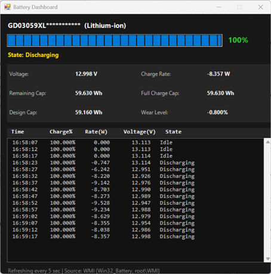
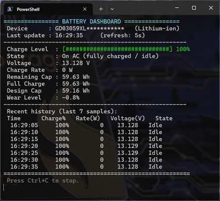

# Battery Dashboard

A lightweight PowerShell tool that shows live battery health and status on Windows —
voltage, charge rate, remaining/full/design capacity, wear level, and charging state.
No admin rights, no third-party tools, no Perfmon required.

## Why this is useful

The standout number here is **Charge Rate**, a live readout of your laptop's power
draw in watts. This isn't available anywhere in the stock Windows UI — Settings,
the taskbar battery icon, and Task Manager only show charge percentage and a rough
time estimate. `powercfg /batteryreport` comes closest, but it's a static historical
report, not a live number.

With a live watt reading you can:
- **See the cost of a workload in real time** — watch the number jump when you kick
  off a high-CPU task (a build, a render, a game) versus what it settles to when the
  system is idle.
- **Compare laptops for efficiency** — run the same task on two machines and compare
  their draw directly, instead of guessing from battery life alone.
- **Spot background drain** — catch a process quietly pulling watts while the laptop
  "should" be idle.

It also surfaces **battery voltage** and **wear level** (design vs. full-charge
capacity), neither of which is exposed in the standard Windows battery UI either.

### Important: what Charge Rate actually measures

Charge Rate is the power flowing into or out of the **battery**, not a direct meter
of total system power draw. What it means depends on whether you're plugged in:

- **On battery (unplugged):** the battery is the only power source, so the discharge
  rate *is* the total system power draw — CPU, GPU, display, everything. This is the
  most accurate reading and the best way to compare workloads or laptop efficiency:
  unplug, run the same task, and compare the negative wattage directly.
- **Plugged in (on AC):** this only shows the power going *into the battery to
  charge it* — it is **not** total system power draw. The adapter powers the running
  system first; whatever it has left over goes to charging. So when you max out the
  CPU while plugged in, Charge Rate drops because less is left over for the battery,
  not because the CPU is "pulling from the battery." If system draw exceeds what the
  adapter can supply, the battery makes up the difference and Charge Rate can go
  negative even while plugged in — but the number is still only the battery's side of
  that balance, not a measurement of the CPU or system itself.

Windows has no general API to read the AC adapter's wattage or live power delivery,
so there's no way to show true total system draw while on AC. For workload/efficiency
comparisons, unplug and use the discharge rate.

## Requirements

- Windows 10/11 with a battery (laptop)
- PowerShell 5.1+ (built into Windows) or PowerShell 7+
- `.NET Windows Forms` (built into Windows, used for GUI mode only)

## Usage

### Before you start

After downloading, Windows will likely block the script because it came from the
internet. Unblock it once:

```powershell
Unblock-File .\Battery-Dashboard.ps1
```

### GUI mode (default)

Right-click the `.ps1` file and choose **Run with PowerShell**,
or run `.\Battery-Dashboard.ps1` from a PowerShell prompt:



### Console mode

```powershell
.\Battery-Dashboard.ps1 -Console
```



### Refresh interval

Set a custom refresh interval in seconds (works with either mode):

```powershell
.\Battery-Dashboard.ps1 -IntervalSeconds 2
.\Battery-Dashboard.ps1 -Console -IntervalSeconds 2
```

### Logging to a file

Console mode can log every sample to a CSV file, useful for reviewing a session
afterward or comparing runs (e.g. idle vs. under load):

```powershell
.\Battery-Dashboard.ps1 -Console -Log
```

The file is created next to the script and named automatically using the computer
name and date: `BatteryLog_<ComputerName>_<yyyy-MM-dd>.csv`. Running it again the
same day on the same machine appends to that file. `-Log` is ignored (with a
warning) in GUI mode.

## What it shows

| Field | Description |
|---|---|
| Charge Level | Current charge %, color-coded (red < 20%, yellow < 50%, green otherwise) |
| State | Charging / Discharging / On AC (idle or full) |
| Voltage | Current battery voltage (V) |
| Charge Rate | Power into/out of the **battery**, in watts. On battery = total system draw. On AC = only what's left over for charging, not total system draw. See [Why this is useful](#why-this-is-useful) |
| Remaining / Full / Design Capacity | In Wh, matching the units used by tools like HWiNFO |
| Wear Level | `1 - (full charge capacity / design capacity)`, an estimate of battery degradation |
| History | Rolling log of recent samples (last 10 in console mode, last 100 in GUI mode) |

## Data source

All values come from Windows WMI:
- `Win32_Battery` — basic battery info, fallback charge %
- `root\WMI` classes: `BatteryStaticData`, `BatteryFullChargedCapacity`, `BatteryStatus`
- `Win32_ComputerSystem` — computer model, queried once at startup
- `Win32_Processor` — CPU name, queried once at startup

This is the same underlying data Windows itself uses; no drivers or extra software are required.

## Stopping

- Console mode: press `Ctrl+C`.
- GUI mode: close the window.

## Author

Craig Cooley — July 2026. Built with Kiro-CLI.
